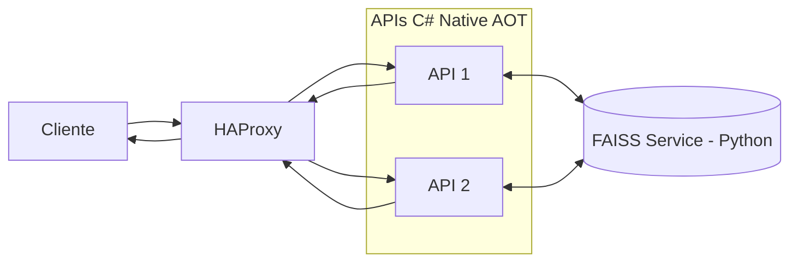

# Rinha de Backend 2026 - C# AOT + FAISS (Python)

## Visão geral

Arquitetura distribuída composta por duas APIs em C# compiladas com Native AOT e um serviço separado em Python utilizando FAISS para busca por similaridade vetorial.

Repositório oficial da Rinha de Backend 2026 com instruções para a execução do teste:
- https://github.com/zanfranceschi/rinha-de-backend-2026

Artigos sobre o desafio e insights:

- https://micheloliveira.com/blog/reduzindo-latencia-rinha-de-backend-2026-faiss-direto-nas-apis-dotnet/
- https://micheloliveira.com/blog/desafio-performance-rinha-backend-2026-insights-csharp-faiss/

---

## Características

- ASP.NET Core Minimal APIs Native AOT
- Serviço FAISS isolado em Python
- Busca ANN utilizando índice IVF
- Armazenamento vetorial em FP16
- APIs independentes com balanceamento via HAProxy
- Baixa latência para a busca vetorial
- Índice carregado em memória (se não existe, é gerado) no startup
- Separação entre camada HTTP e mecanismo vetorial
- Serviço de similaridade compartilhado entre múltiplas APIs

---

## Arquitetura



---

## Componentes

### APIs (C# Native AOT)

- Duas instâncias stateless
- Compilação Ahead-of-Time (AOT)

Responsabilidades:

- Receber requisições HTTP
- Normalizar os dados
- Consultar o serviço FAISS
- Processar regras de negócio
- Retornar resposta final

---

### Serviço de Similaridade (FAISS - Python)

- Motor de busca vetorial utilizando FAISS
- Busca ANN via índice IVF
- Vetores armazenados em FP16
- Índice carregado integralmente em memória
- Serviço independente das APIs
- Baixa latência para consultas vetoriais

Responsabilidades:

- Carregar embeddings treinados
- Executar busca vetorial
- Retornar labels e scores de similaridade
- Compartilhar índice entre múltiplas APIs

---

### HAProxy

- round-robin

---

## Fluxo de requisição

1. Cliente envia requisição para o HAProxy
2. HAProxy distribui para API 1 ou API 2
3. API recebe e normaliza os dados
4. API consulta o serviço FAISS
5. Serviço FAISS executa busca vetorial
6. Serviço retorna resultados de similaridade
7. API monta resposta final
8. Resposta retorna ao cliente via HAProxy

---

## Executando via docker-compose

Ambiente restrito conforme as regras do desafio:

```bash
cd src/
docker compose up -d
```

---

## Endpoints expostos conforme documentação oficial do desafio na porta 9999

- https://github.com/zanfranceschi/rinha-de-backend-2026/blob/caa53569a03b4c85fa07ae9bdd40f995b9826aa2/docs/br/README.md

---

## Execução em modo de desenvolvimento

## FAISS service

### Pré-requisitos do FAISS para desenvolvimento local

python3, python3-pip, python3-venv

#### Instalação no Linux
```
sudo apt-get install -y \
    python3 \
    python3-pip \
    python3-venv
```

```bash
cd src/faiss-backend

bash init.sh
bash run.sh
```

---
## APIs C#

---

### Workspace / Solution

```bash
src/rinha-de-backend-2026-dotnet-csharp.code-workspace
src/rinha-de-backend-2026-dotnet-csharp.sln
```

---

## Resources oficiais base da execução

```bash
src/faiss-backend/references.json.gz
src/backend/Resources/mcc_risk.json
src/backend/Resources/normalization.json
```

---

## Resources gerados com a base oficial references.json.gz

```bash
src/faiss-backend/train/references.faiss
src/faiss-backend/train/labels.npy
```

---